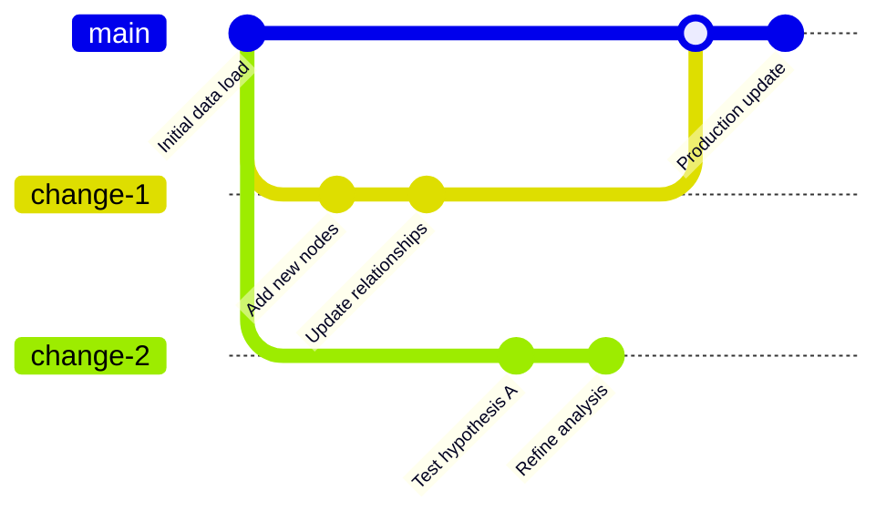
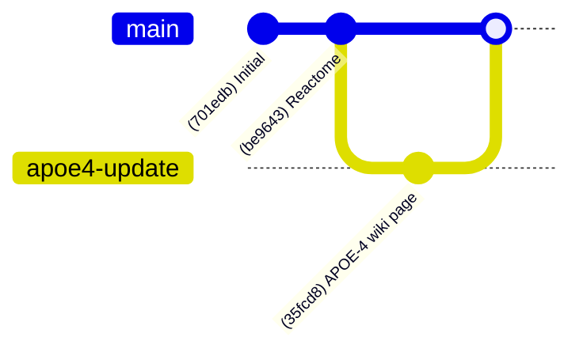

TuringDB is a graph database that stores connected data (nodes and relationships) with **built-in version control**. The system combines graph database capabilities with **time travel**, enabling isolated workspaces, full change tracking, and safe collaboration—without merge conflicts or stale state worries.



With version control, you can explore ideas in parallel, test "what-if" hypotheses, reproduce past states, and audit data evolution. It's like Git—but for graph data.

## Core Concepts

TuringDB's versioning scheme borrows familiar concepts from Git and Perforce:

Commit: A unit of change. Commits include new nodes/edges, updates, or deletions.

Main branch: Canonical history of all accepted and merged commits.

Change: An isolated "branch" of the graph where you can make commits without affecting main.

HEAD: The current tip of a Change or the main branch—i.e., the active snapshot of your graph.

With these primitives, you can:

Safely experiment in isolation

Audit the entire commit history

"Time travel" by checking out a past commit

Reproduce previous analyses and results

Roll back accidental or problematic changes

## Usage Guide

1. Create and switch to a new Change

```graphql
> change new "my-change"
> checkout "my-change"
```

This creates a new branch (change) called my-change and switches your workspace to it.

2. Modify the graph Make updates using Cypher-style queries:

```graphql
> CREATE ...
> SET ...
> commit
```

A change can contain any number of commits. Each commit captures the exact transformation applied to the graph.

3. Merge back to main Once you're happy with your updates:

```graphql
> change submit
> history
```

This submits your change to the main branch and merges all its commits. You can then inspect your updated graph history.

## Practical Example: Protein Interaction Study

Load the Reactome knowledge graph

```graphql
> history

+-----------------------+
| Commit: 701edb        |
+-----------------------+
| Commit: be9643 (HEAD) |
|   - 2,588,826 nodes   |
|   - 10,042,846 edges  |
+-----------------------+
```

Query original graph

```graphql
> MATCH (n:Protein {`displayName (String)`: 'APOE-4 [extracellular region]'})-->(m)
  RETURN n,  m.`displayName (String)`
   
+--------+-----------------------------------------+
| 514785 | extracellular region                    |
+--------+-----------------------------------------+
| 514785 | Homo sapiens                            |
+--------+-----------------------------------------+
| 514785 | UniProt:P02649 APOE                     |
+--------+-----------------------------------------+
| 514785 | L-cysteine 112 replaced with L-arginine |
+--------+-----------------------------------------+
```

Add new data

```graphql
> MATCH (n {`displayName (String)`: 'APOE-4 [extracellular region]'})
  CREATE (n)-[e:HasWikipediaPage]->
         (m:WikipediaPage {
             `displayName (String)`: "APOE-4 wiki",
             `url (String)`: "https://en.wikipedia.org/wiki/Apolipoprotein_E"
         })
```

This adds a WikipediaPage node and connects it to APOE-4.

Submit the change

```graphql
> change submit
> history

+-----------------------+
| Commit: 701edb        |
+-----------------------+
| Commit: be9643        |
|   - 2,588,826 nodes   |
|   - 10,042,846 edges  |
+-----------------------+
| Commit: 35fcd8 (HEAD) |
|   - 1 nodes           |
|   - 1 edges           |
+-----------------------+
```

The current state of the graph's history can be represented by the following diagram.

Updated graph history



Now everyone sees the APOE-4 wiki connection as part of the main graph.

```graphql
> MATCH (n {`displayName (String)`: 'APOE-4 [extracellular region]'})-->(m)
  RETURN n,  m.`displayName (String)`
   
+--------+-----------------------------------------+
| 514785 | **APOE-4 wiki**                             |
+--------+-----------------------------------------+
| 514785 | extracellular region                    |
+--------+-----------------------------------------+
| 514785 | Homo sapiens                            |
+--------+-----------------------------------------+
| 514785 | UniProt:P02649 APOE                     |
+--------+-----------------------------------------+
| 514785 | L-cysteine 112 replaced with L-arginine |
+--------+-----------------------------------------+
```

Time Travel Need to reproduce a past result? Just check out a previous commit:

```graphql
> checkout be9643
> MATCH (n {`displayName (String)`: 'APOE-4 [extracellular region]'})-->(m)
  RETURN n,  m.`displayName (String)`
   
+--------+-----------------------------------------+
| 514785 | New APOE-4 neighbour                    |
+--------+-----------------------------------------+
| 514785 | extracellular region                    |
+--------+-----------------------------------------+
| 514785 | Homo sapiens                            |
+--------+-----------------------------------------+
| 514785 | UniProt:P02649 APOE                     |
+--------+-----------------------------------------+
```

Poof—back in time. The Wikipedia node vanishes because it didn't exist yet in this snapshot.

> TuringDB gives you Git-style power, but for graph data. Explore, simulate, track, and revert—all in real time.