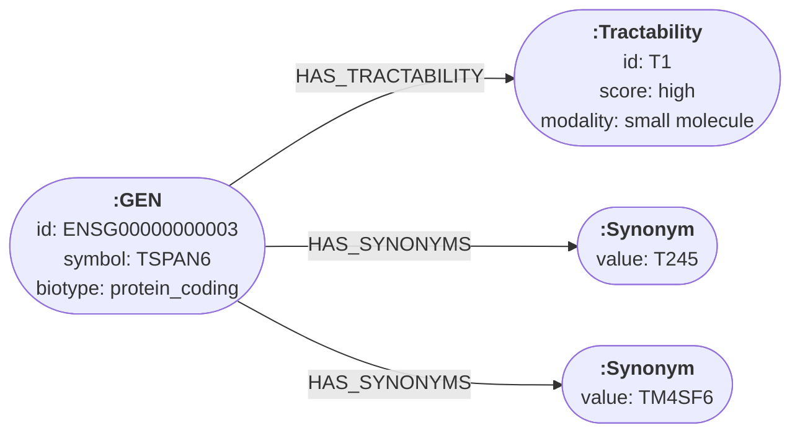
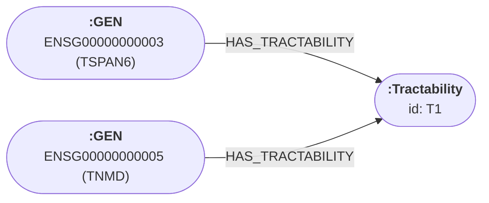

`turing-parquet` is a CLI tool that reads node and edge Parquet files and writes a TuringDB graph to disk. Copy the resulting graph directory into your TuringDB working directory and open it with `turingdb`.

## When to use it

- You have one or more Parquet tables of nodes and edges (a common shape for biomedical, financial, or web-scale knowledge graphs).
- Per-row properties are encoded as a **JSON string column** (typically named `properties`), possibly containing nested objects and arrays.
- You want nested JSON sub-records to be expanded into their own nodes with `HAS_*` edges, with automatic deduplication of repeated values.

## Quick usage

```bash
turing-parquet \
    -nodes data/nodes.parquet \
    -edges data/edges.parquet \
    -out  ./turingdb.out \
    -graph mygraph
```

This writes the graph `mygraph` under `./turingdb.out/graphs/`. Move that subdirectory into your TuringDB working directory (default `$HOME/.turing/graphs/`) and load it with `load mygraph`.

## Expected file format

`turing-parquet` expects a fixed set of top-level columns on each file. Other columns are ignored.

**Node files** (`-nodes`):

| Column           | Requirement                                                                                                   |
| ---------------- | ------------------------------------------------------------------------------------------------------------- |
| `id`             | Required. String. Unique node identifier referenced by edges.                                                 |
| `label`          | Required. String. Becomes the node label in TuringDB (e.g. `GEN`, `DIS`, `DRG`).                              |
| properties col.  | Required. JSON string. Default column name is `properties`; override with `-props COLUMN`.                    |

**Edge files** (`-edges`):

| Column           | Requirement                                                                                                                            |
| ---------------- | -------------------------------------------------------------------------------------------------------------------------------------- |
| `from`           | Required. String. Source node `id`.                                                                                                    |
| `to`             | Required. String. Target node `id`.                                                                                                    |
| edge-type col.   | Required. String. Becomes the edge type in TuringDB. Default column name is `relation`; override with `-edgetype COLUMN`.              |
| properties col.  | Required. JSON string. Same column as nodes (default `properties`).                                                                    |

<Tip>
  The properties column is parsed as JSON. Scalar fields become node/edge properties; nested objects become **sub-record nodes** linked by `HAS_<FIELD>` edges; arrays of objects become multiple sub-record nodes. Identical sub-records (same inferred label + `id`/`value`) are deduplicated into a single shared node.
</Tip>

## Import steps

The example below uses the [OptimusKG](https://optimuskg.ai/) biomedical knowledge graph (190,531 nodes across 10 entity types and ~21.8M edges across 26 relation types), shipped as `nodes.parquet` and `edges.parquet`.

<Steps>
  <Step title="Run turing-parquet against your files">
    ```bash
    turing-parquet \
        -nodes data/nodes.parquet \
        -edges data/edges.parquet \
        -out  ./turingdb.out \
        -graph optimuskg
    ```

    What each flag does:

    | Flag        | Purpose                                                                                                                                                       |
    | ----------- | ------------------------------------------------------------------------------------------------------------------------------------------------------------- |
    | `-nodes`    | Path to a node Parquet file. Repeatable. Pass `-nodes` multiple times for sharded inputs.                                                                     |
    | `-edges`    | Path to an edge Parquet file. Repeatable.                                                                                                                     |
    | `-props`    | Column name to merge JSON property analysis on. Defaults to `properties` when present in every input; otherwise the tool prompts.                             |
    | `-edgetype` | Column name to derive edge types from. Defaults to `relation` when present in any edge file; otherwise the tool prompts.                                      |
    | `-out`      | TuringDB root directory (default `./turingdb.out`). Created if absent; existing graphs in the same directory are preserved.                                   |
    | `-graph`    | Graph name to write inside `-out` (default `imported`). If a graph with this name already exists in the directory, its subdirectory is wiped before writing. |

    The tool prints the inferred schema, a JSON property-type breakdown, an edge-type histogram, and the final node/edge/sub-record counts.
  </Step>
  <Step title="Copy the graph into your TuringDB working directory">
    ```bash
    cp -r ./turingdb.out/graphs/optimuskg ~/.turing/graphs/
    ```

    (Or point `turingdb start` at the import directory directly with `-turing-dir ./turingdb.out`.)
  </Step>
  <Step title="Load the graph and query it">
    <Tabs>
      <Tab title="Cypher">
        ```jsx
        load optimuskg

        cd optimuskg

        MATCH (n:GEN) WHERE n.symbol = 'TSPAN6' RETURN n.id, n.symbol, n.biotype
        ```
      </Tab>
      <Tab title="Python SDK">
        ```python
        from turingdb import TuringDB

        client = TuringDB(host="http://localhost:6666")
        client.load_graph("optimuskg")
        client.set_graph("optimuskg")

        df = client.query(
            "MATCH (n:GEN) WHERE n.symbol = 'TSPAN6' "
            "RETURN n.id, n.symbol, n.biotype"
        )
        print(df)
        ```
      </Tab>
    </Tabs>
  </Step>
</Steps>

<Check>
  Your Parquet files are now a queryable TuringDB graph.
</Check>

## Sub-record expansion

Because the properties column is JSON, nested structure in the source data is preserved as part of the graph. For OptimusKG, this turns 190,531 source rows into about 5M nodes.

### Mapping rules

- Each scalar JSON field on a node becomes a property on that node.
- Each nested object becomes a separate node linked by a `HAS_<FIELD>` edge.
- Each array of objects becomes multiple sub-record nodes via repeated `HAS_<FIELD>` edges.
- Sub-records with the same inferred label and `id`/`value` are deduplicated into a single shared node. A handful of distinct `:Tractability` values can be referenced by hundreds of thousands of genes.

The mapping is printed during import so you can see the inferred sub-record labels and which properties land where.

### Example

Take a single row in `nodes.parquet` for the gene **TSPAN6**:

| `id`              | `label` | `properties`                                                                                                                                                                                                                                                  |
| ----------------- | ------- | ------------------------------------------------------------------------------------------------------------------------------------------------------------------------------------------------------------------------------------------------------------- |
| `ENSG00000000003` | `GEN`   | `{"symbol":"TSPAN6","biotype":"protein_coding","tractability":{"id":"T1","score":"high","modality":"small molecule"},"synonyms":[{"value":"T245"},{"value":"TM4SF6"}]}`                                                                                       |

The `properties` JSON, pretty-printed:

```json
{
  "symbol": "TSPAN6",
  "biotype": "protein_coding",
  "tractability": {
    "id": "T1",
    "score": "high",
    "modality": "small molecule"
  },
  "synonyms": [
    {"value": "T245"},
    {"value": "TM4SF6"}
  ]
}
```

After import, this single row becomes **four nodes** and **three edges**:



How each piece of the source row maps:

| Source                  | Becomes                                                                       |
| ----------------------- | ----------------------------------------------------------------------------- |
| `id`, `label`           | The `:GEN` node's identity and label.                                         |
| `symbol`, `biotype`     | Scalar properties on the `:GEN` node.                                         |
| `tractability` (object) | A `:Tractability` node, linked by a `HAS_TRACTABILITY` edge.                  |
| `synonyms` (array)      | Two `:Synonym` nodes, each linked by its own `HAS_SYNONYMS` edge.             |

### Deduplication in action

If a second gene row also has `"tractability": {"id": "T1", ...}`, the importer recognizes the matching `id` and **reuses the same `:Tractability` node** instead of creating a duplicate:



In the real OptimusKG dataset, just 19 distinct `:Tractability` nodes back the 528,500 `HAS_TRACTABILITY` edges from every gene that references one. The natural key is `id` when present, falling back to `value` and then to the full sub-record content.

## Verify the import

<Tabs>
  <Tab title="Cypher">
    ```jsx
    CALL db.labels()
    CALL db.edgeTypes()
    CALL db.propertyTypes()
    ```
  </Tab>
  <Tab title="Python SDK">
    ```python
    print(client.query("CALL db.labels()"))
    print(client.query("CALL db.edgeTypes()"))
    print(client.query("CALL db.propertyTypes()"))
    ```
  </Tab>
</Tabs>
