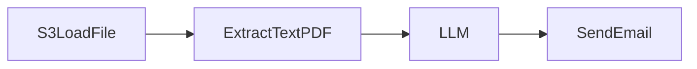
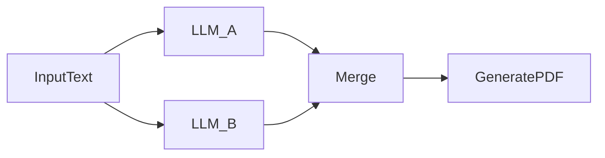

# 🔁 Workflow Concepts

TuringDB lets you build powerful **analytical** and **agentic workflows** using our **Python SDK** or directly in **TuringDB Cloud**.

These workflows combine **data processing**, **AI model orchestration**, and **graph-native storage** in a seamless, visual pipeline that integrates with TuringDB’s graph engine.

Use them to:

- Analyze files with AI and enrich your graphs
- Build LLM-based memory on top of your data
- Orchestrate custom pipelines with branching logic, REST APIs, and more

## 🧠 LangGraph Wrapper for Workflows

We use **LangGraph** as the core execution engine to manage:

- Flow of data between tasks (nodes)
- Execution scheduling
- Edge connections between operations

### 🔧 Why We Built a Wrapper

Our wrapper around LangGraph enables:

1. **Declarative JSON execution**
   - Define a list of nodes and their edges
   - Specify parameters like API keys, prompts, and output fields
   - The engine will infer the execution flow and run the correct Python functions behind the scenes

   ⚙️ No need to manually code LLM calls or file I/O, just describe what you want, and we execute it.
2. **Expression-based JSON referencing**
   - We treat LangGraph as a **data propagation engine**
   - All data flows in a shared, structured JSON object
   - You can reference any part of that JSON using flexible expressions (`$data.field`, `$array[i]`, etc.)
   - This makes the system modular, extensible, and easy to integrate with APIs or databases

## 🧱 Workflow Structure

A workflow is a graph of **nodes** connected by **edges** where **data flows** from one node to another.

### 🧩 Core Components

- **Nodes**: Units of execution (e.g., extract text, call an LLM, fetch stock data)
- **Edges**: Define the order of execution and pass data between nodes
- **Execution Engine**: Schedules and runs nodes in the correct order
- **Data JSON**: A shared object where all intermediate data is stored

### 🧾 Example Use Case: Document Analysis

1. Load a PDF from S3
2. Extract the text content
3. Use LLM to list company tickers
4. Loop through each ticker and fetch financial data
5. Format and output the results

### 🧠 Workflow JSON (example)

```json expandable
{
  "nodes": [
    {
      "id": 0,
      "inputs": [],
      "outputs": [1],
      "name": "S3LoadFile_0",
      "node_type": "S3LoadFile",
      "params": {
        "output_field": { "field": "pdf_base64", "action": "set" },
        "file_key": "file_key.pdf",
        "user_id": "<user_id>",
        "file_type": "pdf"
      }
    },
    {
      "id": 1,
      "inputs": [0],
      "outputs": [2],
      "name": "ExtractTextPDF_1",
      "node_type": "ExtractTextPDF",
      "params": {
        "input_field": { "field": "pdf_base64", "action": "set" },
        "output_field": { "field": "pdf_text", "action": "set" }
      }
    },
    {
      "id": 2,
      "inputs": [1],
      "outputs": [3],
      "name": "LLM_2",
      "node_type": "LLM",
      "params": {
        "input_field": { "field": "pdf_text.all_content", "action": "set" },
        "output_field": { "field": "list_companies_tickers", "action": "set" },
        "llm_provider": "Anthropic",
        "model": "claude-3-5-haiku-latest",
        "temperature": 0,
        "max_tokens": 5092
      }
    },
    {
      "id": 3,
      "inputs": [2, 5],
      "outputs": [4],
      "name": "ForEach_3",
      "node_type": "ForEach",
      "params": {
        "list_field": { "field": "list_companies_tickers", "action": "set" },
        "offset_field": { "field": "i", "action": "set" }
      }
    },
    {
      "id": 4,
      "inputs": [3],
      "outputs": [5],
      "name": "FinancialDataRestAPI_4",
      "node_type": "FinancialDataRestAPI",
      "params": {
        "output_field": { "field": "$stock_prices", "action": "append" },
        "api_key": "<your_api_key>",
        "endpoint_type": "stock_prices",
        "identifier": { "field": "$list_companies_tickers[$i]", "action": "set" }
      }
    },
    {
      "id": 5,
      "inputs": [4],
      "outputs": [3],
      "name": "OutputText_5",
      "node_type": "OutputText",
      "params": {
        "input_field": { "field": "$stock_prices[$i]", "action": "set" },
        "output_field": { "field": "$stock_prices_all[$i]", "action": "append" }
      }
    }
  ]
}
```

## 🔌 Node Concepts

A **Node** is a building block of your workflow that performs a single task.

### 🧬 Node Anatomy

- `node_type`: What it does (e.g., `LLM`, `ExtractTextPDF`, `SendEmail`)
- `params`: Key parameters, API keys, fields, configs
- `input_field`: Where to read input data from the workflow JSON
- `output_field`: Where to write output data in the workflow JSON

### 💡 Example: Email Node

```python
SendEmail.Params(
		input_field="report_content",
    output_field="email_status",    
    from_email="workflow@company.com",
    to_emails=["user@example.com"],
    subject="Daily Report",
    sendgrid_api_key="SG.abc123..."
)
```

### 🛠 Common Node Types

| Node Type                                 | Purpose                             |
| ----------------------------------------- | ----------------------------------- |
| `S3LoadFile`                              | Load a file from cloud storage      |
| `ExtractTextPDF`                          | Extract content from PDF files      |
| `LLM`                                     | Query OpenAI, Anthropic, or Mistral |
| `RestAPI`                                 | Fetch data from external APIs       |
| `SendEmail`                               | Send email notifications            |
| `GeneratePDF`                             | Create PDFs from text               |
| `OutputText`                              | Standardise outputs from workflows  |
| [… see more in detailed node documentation](/nodes_references) |                                     |

## 🔗 Edge Concepts

**Edges** connect nodes and define the flow of data and order of operations.

### 🔁 Data Flow

- Node A completes → stores its result in a field
- Node B reads from that field using `input_field`
- This forms a **chain of transformations**

### 📋 Execution Order

- A node cannot run until all its input nodes complete
- Edges determine dependencies
- The workflow engine schedules nodes accordingly

### ➕ Edge Input Rules

| Node Type   | Input Type      | Notes                                                |
| ----------- | --------------- | ---------------------------------------------------- |
| `LLM`       | Single Input    | Operates on one data source                          |
| `SendEmail` | Single Input    | Sends one message at a time                          |
| `Merge`     | Multiple Inputs | Combines many branches                               |
| `InputText` | Zero Input      | Starts the flow with hardcoded or user-supplied data |
| `RestAPI`   | Zero Input      | Pulls data independently                             |

## 🧠 Examples

### ➤ Simple Chain



### ➤ Parallel Flow with Merge



Build your graph-powered workflows declaratively, visually, or in code, with all the flexibility of a modern execution engine and the performance of TuringDB behind it.